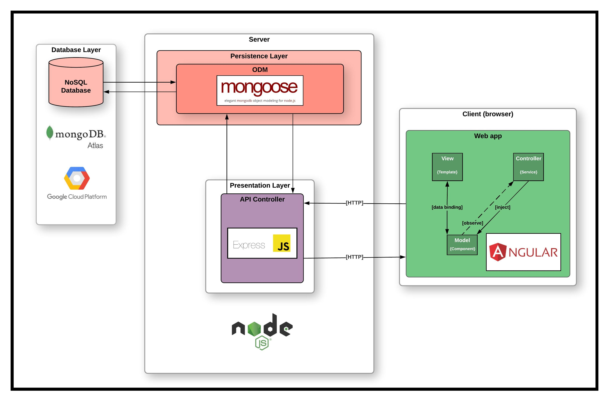

<!-- PROJECT LOGO -->
<br />
<p align="center">
  <a href="https://github.com/iamdanre/SecuriTree">
    
  </a>

  <h3 align="center">SecuriTree</h3>

  <p align="center">
    EPI-USE Labs Recruiting Exercise
    <br />

<!-- TABLE OF CONTENTS -->
<details open="open">
  <summary>Table of Contents</summary>
  <ol>
    <li>
      <a href="#about-the-project">About The Project</a>
      <ul>
        <li><a href="#built-with">Built With</a></li>
        <li><a href="#architectural-diagram">Architecture Diagram</a></li>
      </ul>
    </li>
    <li>
      <a href="#getting-started">Getting Started</a>
      <ul>
        <li><a href="#prerequisites">Prerequisites</a></li>
        <li><a href="#installation">Installation</a></li>
      </ul>
    </li>
    <li><a href="#usage">Usage</a></li>
    <li><a href="#license">License</a></li>
    <li><a href="#contact">Contact</a></li>
  </ol>
</details>

<!-- ABOUT THE PROJECT -->

## About The Project


SecuriTree is an access control management application that provides a visual tree view of the security and access control units installed in a client’s S3(Super Secure Systems) system. This application allows authorised security operatives to monitor and manage physical security and access control units (areas, doors, elevators, floors, etc.), at a client’s premises.

### Built With

- [Node.js](https://nodejs.org)
- [MongoDB Atlas](https://www.mongodb.com/cloud/atlas)
- [mongoose](https://mongoosejs.com)
- [Angular](https://angular.io)
- [Angular Material](https://material.angular.io)
- [Bootstrap](https://getbootstrap.com)

### Architectural Diagram


<!-- GETTING STARTED -->

## Getting Started

The SecuriTree API server runs separately from the web application.

### Prerequisites

The server is built on Node.js which can also be used to serve the static files for the web application.
<br/>
Download and install Node.js for your operating system [here](https://nodejs.org/en/download).

### Installation

1. Open a new Terminal/PowerShell window.

2. Clone or download the repo and navigate to the project folder:
   ```sh
   git clone https://github.com/iamdanre/SecuriTree.git && cd SecuriTree
   ```
3. Server: To run the API server, navigate to the server directory and install dependencies:
   ```sh
   cd server && npm install
   ```
   \*Note: The MongoDB Atlas database will initially be empty for review purposes. The database can be populated using the JSON files in the server/setup directory by passing the command line argument "setup" to server.js like so:
   ```sh
   node server.js setup
   ```
   This will populate the database with the user data required to log in after salting and hashing the passwords. It also populates the relevant system data collections required for constructing the Security Entity Hierarchy.
   <br/>
   If the database is already populated the setup argument may be omitted:
   ```sh
   node server.js
   ```
4. Web App: For simplicity the Angular application has been compiled using the "ng build --prod" command. Open a separate Terminal/PowerShell windows and navigate to:<br/>
   {project-root-directory}/webapp/webserver
   <br/>
   Once in the directory the command:
   ```sh
   npm install && node appServer.js
   ```
   will serve the application.
   Navigate to [http://localhost:8081](http://localhost:8081) in your browser to use the application.

<!-- USAGE -->

## Usage

Using the application is trivial. Chevrons expand and collapse nested data, lock buttons lock doors, unlock buttons unlock doors.

<!-- LICENSE -->

## License

Distributed under the MIT License.

<!-- CONTACT -->

## Contact

Danré - [Telegram](https://t.me/xp_x_qx/) - dev.danre@icloud.com

Project Link: [https://github.com/iamdanre/SecuriTree](https://github.com/iamdanre/SecuriTree)
